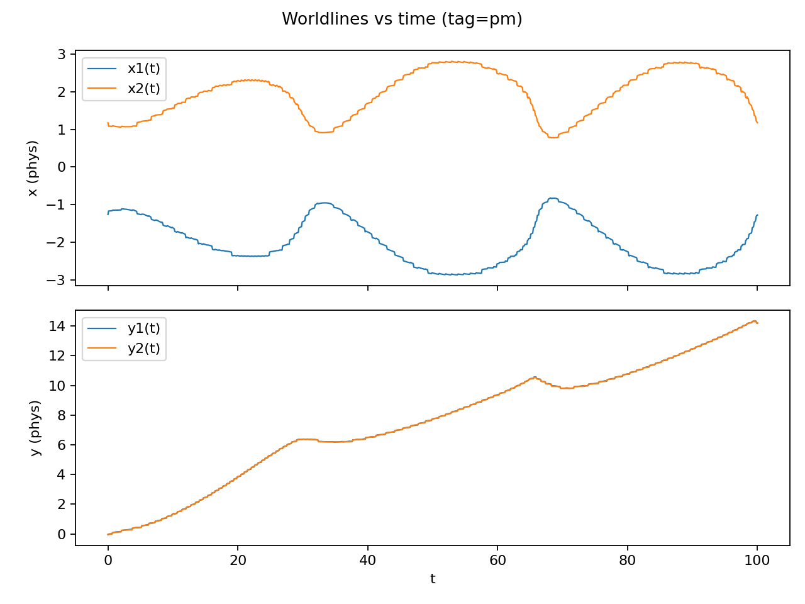
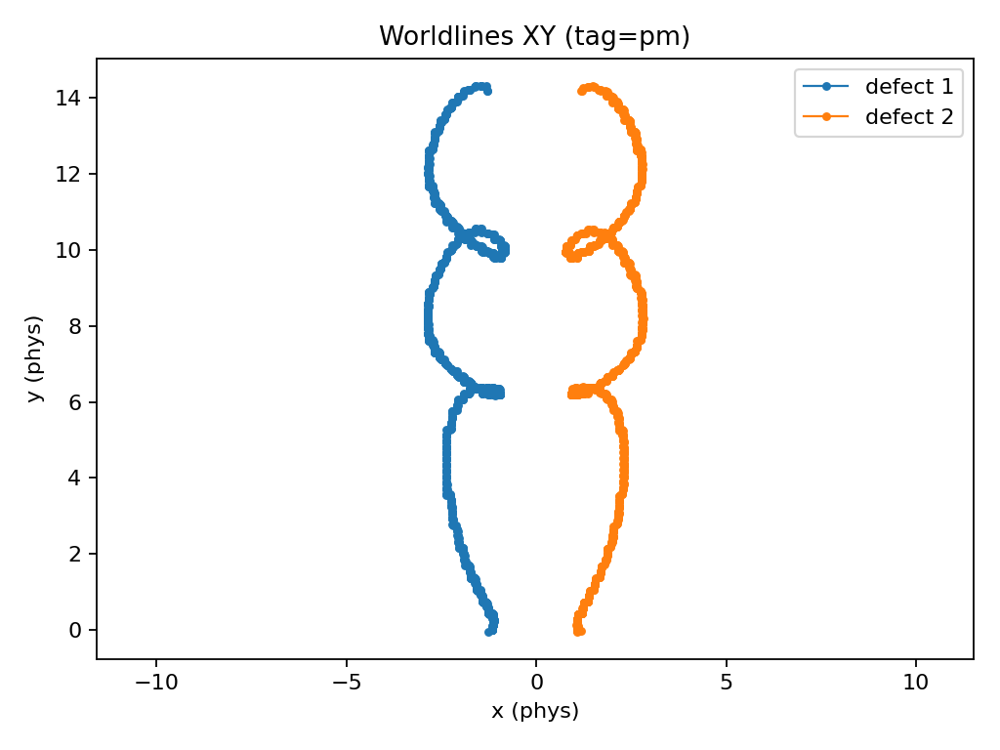

# Phase-Field Topological Emergence (PFTE)

Independent computational physics project investigating whether particle-like behavior and effective interactions can emerge from a single continuous phase field with only local dynamics and topology.

The model uses:
- one complex field ψ(x,t)
- local numerical evolution rules only
- no imposed particles or forces
- defects defined topologically (winding number)

All structure must emerge from the field itself.

---

## Current status

Implemented:
- 2D simulation engine
- defect detection and tracking
- parameter sweeps
- trajectory/worldline extraction
- quantitative metrics and scaling fits

---

## Example results

Stable defect pairs exhibit long-lived, oscillatory bound motion in narrow parameter regimes.

Example shown here:
D = 0.0361, c1 = 4

### Worldlines (x,y vs time)

### Spatial trajectories (XY)

---

## Goal

Determine the minimal structural ingredients required for:
- persistent identities
- interactions
- effective particle-like dynamics

---

This repository serves as an open, timestamped record of ongoing development.
